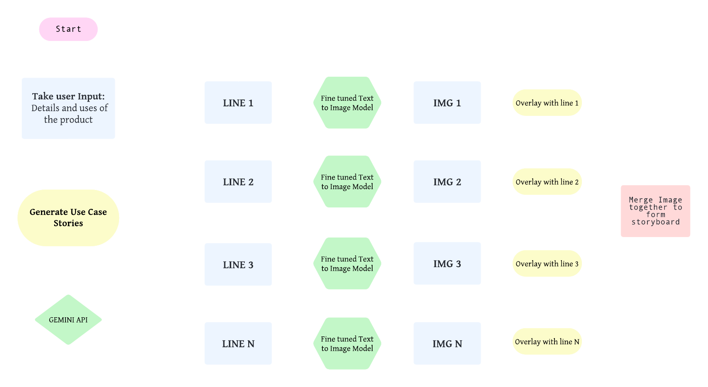

<h2>Introduction</h2>

Incorporating text-to-image technology into the storyboard creation process offers a revolutionary approach to visual storytelling. By leveraging advanced algorithms, textual descriptions of product features and user interactions can be dynamically transformed into compelling visual representations. This fusion of language and imagery not only enhances the efficiency of storyboard creation but also enriches the communication of complex concepts and scenarios. Through the seamless integration of text-to-image capabilities, this project aims to elevate the storyboard creation process, ensuring that each frame succinctly captures the essence of the user's narrative while stimulating engagement and understanding among stakeholders and collaborators.

<h2>Problem statement</h2>

Developing a comprehensive storyboard for a user interface (UI)/user experience (UX) project based solely on user descriptions poses challenges in accurately capturing product functionalities and user interactions. This project aims to address this by generating use case stories and corresponding visual representations, culminating in a cohesive storyboard for effective communication.

<h2>Methodology</h2>

<h2>technological stack</h2>
<ul>
  <li>1. Hugging Face</li>
  <li>2. Colab</li>
  <li>3. HugChat API</li>
  <li>4. Python</li>
  <li>5. Python Libraries</li>
  <li>6. ML Libraries</li>
</ul>

<h2>Features</h2>
    <ul>
        <li>Dynamic Storyboard Creation</li>
        <li>User-Generated Use Case Stories</li>
        <li>Text-to-Image Conversion</li>
        <li>Visual Representation of Scenarios</li>
        <li>Seamless Integration of Text and Imagery</li>
        <li>Enhanced Communication and Understanding</li>
        <li>Efficient Collaboration</li>
        <li>Engaging Presentation of Product Utility</li>
        <li>Iterative Design and Development Support</li>
        <li>Text Translation for Multilingual Support</li>
    </ul>

