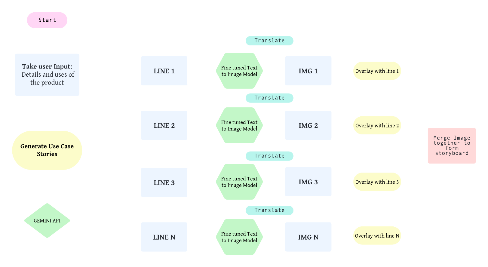
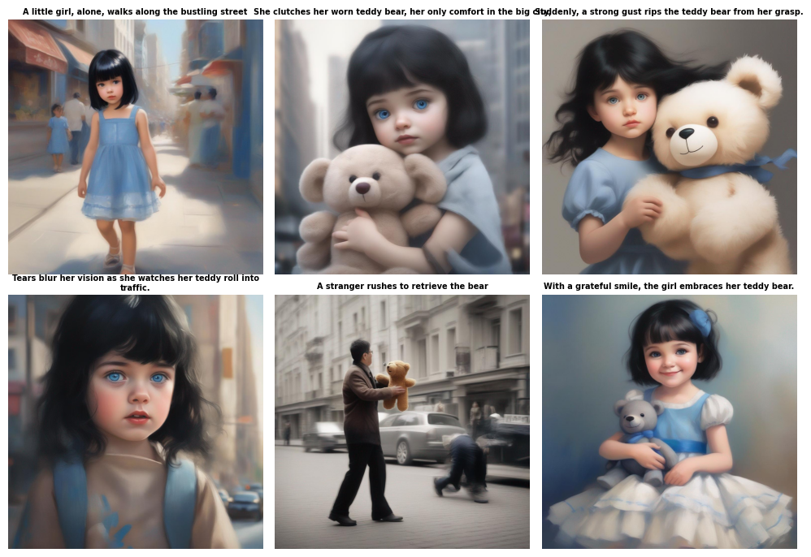
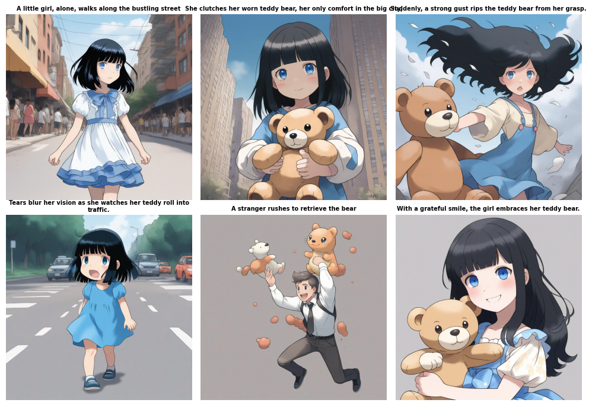
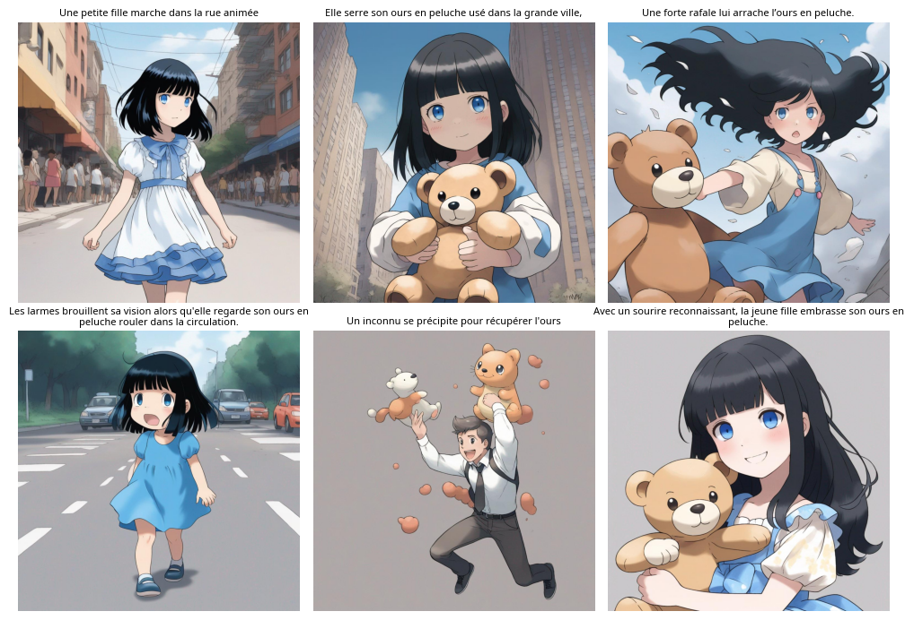

<h2>Introduction</h2>

Incorporating text-to-image technology into the storyboard creation process offers a revolutionary approach to visual storytelling. By leveraging advanced algorithms, textual descriptions of product features and user interactions can be dynamically transformed into compelling visual representations. This fusion of language and imagery not only enhances the efficiency of storyboard creation but also enriches the communication of complex concepts and scenarios. Through the seamless integration of text-to-image capabilities, this project aims to elevate the storyboard creation process, ensuring that each frame succinctly captures the essence of the user's narrative while stimulating engagement and understanding among stakeholders and collaborators.

<h2>Problem statement</h2>

Traditional methods of creating visual storyboards for storytelling are often inefficient and time-consuming due to the manual translation of textual descriptions into visual representations. This process can lead to miscommunication and a lack of clarity, hindering engagement and understanding among stakeholders. The need for a solution that seamlessly integrates text and imagery to enhance efficiency and accuracy is evident.

<h2>Methodology</h2>

<h2>Dataset used for fine tuning</h2>

POKEMON blip captions

<h2>Technological Stack</h2>
<ul>
  <li>Hugging Face</li>
  <li>Colab</li>
  <li>HugChat API</li>
  <li>Python</li>
  <li>Python Libraries</li>
  <li>ML Libraries</li>
</ul>

<h2>Features</h2>
    <ul>
        <li>Dynamic Storyboard Creation</li>
        <li>User-Generated Use Case Stories</li>
        <li>Text-to-Image Conversion</li>
        <li>Visual Representation of Scenarios</li>
        <li>Seamless Integration of Text and Imagery</li>
        <li>Enhanced Communication and Understanding</li>
        <li>Efficient Collaboration</li>
        <li>Engaging Presentation of Product Utility</li>
        <li>Iterative Design and Development Support</li>
        <li>Text Translation for Multilingual Support</li>
    </ul>

<h2>Results:</h2>

<h2>Future Scope</h2>

Incorporating datasets with larger and more diverse images can further enrich the model's understanding of visual concepts and improve its ability to generate high-quality images. Such datasets contain vast collections of images spanning various categories and contexts, offering ample opportunities for training more robust models.

<h2>Conclusion</h2>

This study explores using generative AI models to create visual narratives from text prompts, utilizing the stable-diffusion-xl-base-1.0 model and Pokémon-Blip dataset. By fine-tuning, we improved image quality, integrating Google Translate for prompt translation, with future work focusing on larger datasets and computational efficiency enhancements for immersive storytelling.

